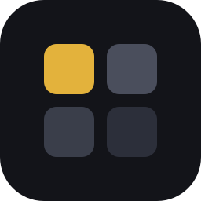
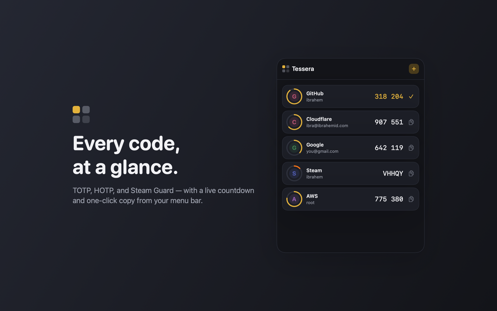

<div align="center">



# Tessera

A TOTP/2FA authenticator for macOS. CLI-first, with a native app.

[](https://github.com/ibrahemid/tessera/actions)
[](LICENSE)
[](https://apps.apple.com/app/tessera-2fa-authenticator/id6788814172)

[**Mac App Store**](https://apps.apple.com/app/tessera-2fa-authenticator/id6788814172) · [**Website**](https://tessera.ibrahemid.com) · [**CLI quick start**](#cli-quick-start)

</div>


Tessera keeps your 2FA codes in an encrypted vault on your Mac, reachable from a native app and a real command line. It ships free what other Mac authenticators paywall (Touch ID, auto-launch), and adds what they lack: a CLI, HOTP, Steam Guard, folders and tags, and one vault that the CLI and the app share. Free, open source, Apache-2.0.

## Features

- TOTP (RFC 6238), HOTP (RFC 4226), Steam Guard
- Import: `otpauth://`, Google Authenticator export (`otpauth-migration://`), QR images (CLI) / on-screen QR (app)
- Encrypted vault: random DEK, XChaCha20-Poly1305 payload, argon2id passphrase wrap, optional Touch ID (Secure Enclave) wrap
- Search, folders, tags, pinning
- No account, no server, no analytics, no network

## The app

<picture>
  <source media="(prefers-color-scheme: light)" srcset="docs/appstore-assets/01-vault-light.png">
  
</picture>

A native SwiftUI app: live codes with countdown rings, one-click copy, on-screen QR scanning, Touch ID unlock. It opens a CLI-created vault in place (asks for its passphrase once, then unlocks via the Secure Enclave; the CLI keeps working on the same file). App-created vaults are Secure-Enclave-bound; move them to the CLI with the app's encrypted export.

## CLI quick start

```sh
go install github.com/ibrahemid/tessera/go/cmd/tess@latest
tess vault init                      # create an encrypted vault
tess add "otpauth://totp/ACME:me@x.com?secret=JBSWY3DPEHPK3PXP&issuer=ACME"
tess add --qr ~/Desktop/code.png     # from a QR image
tess import --migration "otpauth-migration://offline?data=..."
tess                                 # print current codes (colored, with countdown bars)
tess watch                           # live TUI: countdown bars, search (/), copy (enter/c), q to quit
tess code acme -c                    # code for one account, copied to the clipboard
tess code ac -c                      # reference an account by its handle (shown by `tess list`)
tess alias ac work                   # set an account's handle
tess code --json                     # machine-readable output for scripts
tess ls --json                       # alias for `tess list`
tess vault remember                  # store the passphrase in the macOS login keychain
tess vault status                    # path, file details, wrap methods, keychain state
tess export --uri acme               # otpauth URI (cleartext secret)
tess completion zsh > ...            # shell completions (bash/zsh/fish)
```

Colored output auto-disables when piped or when `NO_COLOR` is set.

Vault path: `$TESSERA_VAULT` or `~/.local/share/tessera/vault.json`. For scripting, set `TESSERA_PASSPHRASE` to avoid the prompt.

On macOS, `tess vault remember` opts into storing the passphrase in the login keychain (`tess vault forget` removes it) so `tess` stops prompting; the entry is protected by the login keychain at the same trust level as an ssh key on disk.

## Security model

- Secrets are stored as raw bytes inside an encrypted vault; base32 only appears at otpauth boundaries.
- Vault: a random 256-bit DEK encrypts the account payload (XChaCha20-Poly1305, 24-byte nonces). The DEK is wrapped per unlock method (argon2id-derived passphrase key on every platform; a biometric-gated Secure Enclave key on the Mac). Adding/removing an unlock method re-wraps the DEK without re-encrypting the payload.
- Two independent implementations (Go, Swift) share one documented format and a byte-exact interop vector suite, with cross-decrypt and negative (tamper / wrong-passphrase / base64url) tests.
- No analytics, no servers. See [SECURITY.md](SECURITY.md) for reporting.

The exact rules live in [`spec/vault-format.md`](spec/vault-format.md) and [`spec/otpauth.md`](spec/otpauth.md).

## Repository layout

| Path | What |
|------|------|
| `spec/` | Source of truth: vault format, otpauth/OTP rules, shared interop test vectors |
| `go/` | The `tess` CLI and its core (Go 1.26) |
| `swift/` | `TesseraCore` library + the SwiftUI app |
| `interop` / CI | Both implementations are checked against `spec/testvectors.json` |

Build instructions in [`docs/BUILD.md`](docs/BUILD.md).

## License

Apache-2.0.
